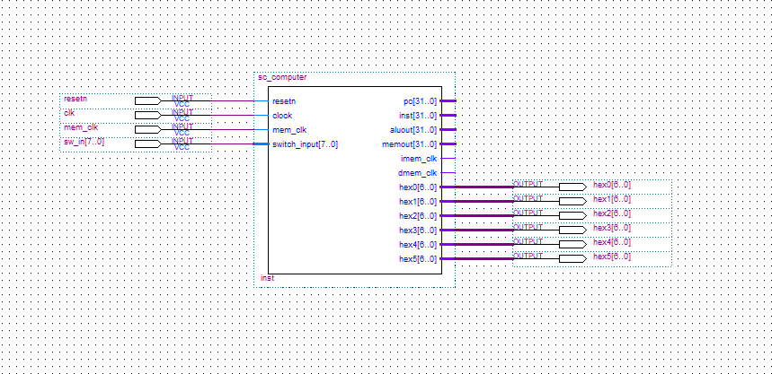

# 5段流水CPU设计 实验报告

- 学号：516202910010
- 姓名：邓公淯

## 实验目的

1. 理解计算机指令流水线的协调工作原理，初步掌握流水线的设计和实现原理。
2. 深刻理解流水线寄存器在流水线实现中所起的重要作用。
3. 理解和掌握流水段的划分、设计原理及其实现方法原理。
4. 掌握运算器、寄存器堆、存储器、控制器在流水工作方式下，有别于单周期CPU的设计和实现方法。
5. 掌握流水方式下，通过I/O端口与外部设备进行信息交互的方法。

## 实验仪器与平台

- 硬件：DE1-SoC实验板
- 软件：Altera Quartus II 13.1 Web Edition、Altera ModelSim 10.1d、MIPS指令集汇编器

## 实验内容和任务

1. 采用Verilog在Quartus II中实现基本的具有20条MIPS指令的5段流水线CPU设计。
2. 利用实验提供的标准测试程序代码，完成仿真测试。
3. 采用I/O统一编址方式，即将输入输出的I/O地址空间，作为数据存取空间的一部分，实现CPU与外部设备的输入输出端口设计。实验中可采用高端地址。
4. 利用设计的I/O端口，通过lw指令，输入DE2实验板上的按键等输入设备信息。即将外部设备状态读到CPU内部寄存器。
5. 利用设计的I/O端口，通过sw指令，输出对DE2实验板上的LED灯灯输出设备的控制信号（或数据信息）。即将对外部设备的控制数据，从CPU内部的寄存器，写入到外部设备的相应控制寄存器（或可直接连接至外部设备的控制输入信号）。
6. 利用自己编写的程序代码，在自己设计的CPU上，实现对板载输入开关或按键的状态输入，并将判别或处理结果，利用板载LED灯或7段LED数码管显示出来。
7. 例如，将一路4bit二进制输入与另一路4bit二进制输入相加，利用两组分别2个LED数码管以十进制形式显示“被加数”和“加数”，另外一组LED数码管以十进制形式显示“和”等。
8. 在实验报告中，汇报自己的设计思想和方法；并以汇编形式提供MIPS应用功能的程序设计代码，并提供程序主要流程图。

## 顶层设计



板载50MHz时钟（`CLOCK_50`)作为CPU时钟信号。`resetn`作为重置信号，`sw_in[7..0]`作为8为开关输入信号。`hex0-5[6..0]`作为7段LED输出信号，其余输出用于仿真验证，故未分配针脚。

## 实验代码

### 主模块

```verilog
module sc_cpu (clock,resetn,
					ins,mmo,pc,
					mwmem,malu,mb);
   input [31:0] ins,mmo;
   input clock,resetn;
   output [31:0] pc,malu,mb;
   output mwmem;
	
	// pc
	wire[31:0] npc;
	
	// IF
	wire[31:0] inst,dpc4,pc4,bpc;
	wire wpcir;
	
	// ID
	wire[4:0] drn;
	wire[31:0] da,db,q1,q2;
	wire[1:0] pcsource,fwda,fwdb;
	wire[2:0] daluc;
	wire 			  regrt,sext,rsrtequ,e,dwreg,dm2reg,dwmem,dshift,djal,daluimm;
   wire [15:0]   dext;                // high 16 sign bit
   wire [31:0]   dimm; // sign extend to high 16
   wire [31:0]   offset;   //offset(include sign extend)
   
	wire[5:0] func = inst[5:0];
	wire[5:0] op = inst[31:26];
	wire[4:0] rs = inst[25:21];
	wire[4:0] rt = inst[20:16];
	wire[4:0] rd = inst[15:11];
   wire [31:0] jpc = {dpc4[31:28],inst[25:0],2'b00}; // j address 
	
	// EXE
	wire ewmem,ejal,ealuimm,eshift,ewreg,em2reg;
	wire[2:0] ealuc;
	wire[4:0] ern,ern0;
	wire[31:0] alua,alub,ea,eb;
	wire[31:0] eimm,epc4,epc8,ealu,ealu_z;
	wire[31:0] sa = {27'b0,eimm[10:6]};
	wire z;
	
	// MEM
	wire[31:0] mmo,malu,mb;
	wire[4:0] mrn;
	wire mwreg,mm2reg,mwmem;
	
	// WB
	wire wwreg,wm2reg;
	wire[4:0] wrn;
	wire[31:0] wdi,wmo,walu;
                        
	// 程序计数器模块，是最前面一级IF流水段的输入。
   dffe32 ip (npc,clock,resetn,wpcir,pc);
	
	// IF stage
   assign pc4 = pc + 32'h4;
   mux4x32 nextpc(pc4,bpc,da,jpc,pcsource,npc);
	
  // IF/ID regfile
	reg_if_id reg_fd(pc4,ins,wpcir,clock,resetn,dpc4,inst);
	
	// ID stage
   sc_cu cu (mwreg, mrn, ern, ewreg, em2reg, mm2reg, rsrtequ, func,
                op, rs, rt, dwreg, dm2reg, dwmem, daluc, regrt, daluimm,
                fwda, fwdb, wpcir, sext, pcsource, dshift, djal);
   regfile rf (rs,rt,wdi,wrn,wwreg,clock,resetn,q1,q2);
	mux4x32 id_alu_a(q1,ealu,malu,mmo,fwda,da);
	mux4x32 id_alu_b(q2,ealu,malu,mmo,fwdb,db);
   mux2x5 reg_wn (rd,rt,regrt,drn);
	assign rsrtequ = ~|(da^db);
	assign e = sext & inst[15]; 
	assign dext = {16{e}};
	assign dimm = {dext,inst[15:0]};
	assign offset = {dimm[29:0],2'b00};
	cla32 br_addr(dpc4,offset,1'b0,bpc);
	
  // ID/EXE regfile
	reg_id_exe reg_ie(dwreg, dm2reg, dwmem, djal, daluc, daluimm, dshift,
						dpc4, da, db, dimm, drn,
						clock, resetn,
						ewreg, em2reg, ewmem, ejal, ealuc, ealuimm, eshift,
						epc4, ea, eb, eimm, ern0);
	
	// EXE stage
   mux2x32 exe_alu_a (ea,sa,eshift,alua);
   mux2x32 exe_alu_b (eb,eimm,ealuimm,alub);
   alu al_unit (alua,alub,ealuc,ealu_z,z);
	assign epc8 = epc4 + 32'h4;
	mux2x32 save_pc8(ealu_z,epc8,ejal,ealu);
	assign ern = ern0 | {5{ejal}};
	
  // EXE/MEM regfile
	reg_exe_mem reg_em(ewreg,em2reg,ewmem,
						 ealu,eb,ern,
						 clock,resetn,
						 mwreg,mm2reg,mwmem,
						 malu,mb,mrn);
						 
	// MEM stage
	// malu -> aluout
	// eb -> datain
	// mwmem -> we
	// dataout -> mmo
	
  // MEM/WB regfile
	reg_mem_wb reg_mw(mwreg,mm2reg,
						malu,mmo,mrn,
						clock,resetn,
						wwreg,wm2reg,
						walu,wmo,wrn);
						
	// WB stage
	mux2x32 reg_di(walu,wmo,wm2reg,wdi);
	
endmodule

```

由于本次实验采用了单周期实验的模版，同时为了调试方便，将流水线各阶段显式写入了主模块中。

### IF流水段前寄存器内部机制

```verilog
   dffe32 ip (npc,clock,resetn,wpcir,pc);
```

锁存PC值信号。`clock`、`resetn`、`wpcir`分别作为时钟信号、重置信号和写入（使能）信号，使能信号用于实现stall机制。

### IF阶段

```verilog
   assign pc4 = pc + 32'h4;
   mux4x32 nextpc(pc4,bpc,da,jpc,pcsource,npc);
```

该阶段根据`pcsource`信号计算下一条指令的地址`npc`。同时从ROM中读取当前pc指向的地址中的指令。

```verilog
   sc_instmem  imem (pc,inst,clock,mem_clk,imem_clk);   
```

```verilog
module sc_instmem (addr,inst,clock,mem_clk,imem_clk);
   input  [31:0] addr;
   input         clock;
   input         mem_clk;
   output [31:0] inst;
   output        imem_clk;
   
   wire          imem_clk;

   assign  imem_clk = clock & ( ~ mem_clk );      
   
   lpm_rom_irom irom (addr[7:2],imem_clk,inst); 
   
endmodule 
```

### IF/ID流水线寄存器

```verilog
module reg_if_id(pc4,ins,wpcir,clk,clrn,dpc4,inst);
	input[31:0] pc4,ins;
	input wpcir,clk,clrn;
	output[31:0] dpc4,inst;
	dffe32 pc_plus_4(pc4,clk,clrn,wpcir,dpc4);
	dffe32 inst_gen(ins,clk,clrn,wpcir,inst);
endmodule
```

起承接IF阶段和ID阶段的流水任务。在clock上升沿时，将IF阶段需传递给ID阶段的信息，锁存在IF/ID流水线寄存器中，并呈现在ID阶段。

### ID阶段

```verilog
   sc_cu cu (mwreg, mrn, ern, ewreg, em2reg, mm2reg, rsrtequ, func, op, rs, rt, dwreg, dm2reg, dwmem, daluc, regrt, daluimm, fwda, fwdb, wpcir, sext, pcsource, dshift, djal);

  regfile rf (rs,rt,wdi,wrn,wwreg,clock,resetn,q1,q2);
	mux4x32 id_alu_a(q1,ealu,malu,mmo,fwda,da);
	mux4x32 id_alu_b(q2,ealu,malu,mmo,fwdb,db);
  mux2x5 reg_wn (rd,rt,regrt,drn);
	assign rsrtequ = ~|(da^db);
	assign e = sext & inst[15]; 
	assign dext = {16{e}};
	assign dimm = {dext,inst[15:0]};
	assign offset = {dimm[29:0],2'b00};
	cla32 br_addr(dpc4,offset,1'b0,bpc);
```

该阶段包含`cu`和`regfile`，其与单周期CPU不同之处在于：

1. 该阶段提前计算的`rsrtequ`信号取代了ALU产生的`z`信号。
2. 控制器`cu`需要额外检查流水线冒险的情况并产生相应的控制信号。

### 控制器CU

```verilog
module sc_cu (mwreg,mrn,ern,ewreg,em2reg,mm2reg,rsrtequ,func,op,rs,rt,
					wreg,m2reg,wmem,aluc,regrt,aluimm,fwda,fwdb,wpcir,sext,
					pcsource,shift,jal);
   input  [5:0] op,func;
   input mwreg,ewreg,em2reg,mm2reg,rsrtequ;
	input[4:0] mrn,ern,rs,rt;
	
   output       wreg,regrt,jal,m2reg,shift,aluimm,sext,wmem,wpcir;
   output [3:0] aluc;
   output [1:0] pcsource;
	output reg[1:0] fwda,fwdb;
	 
   wire r_type = ~|op;
   wire i_add = r_type & func[5] & ~func[4] & ~func[3] &
                ~func[2] & ~func[1] & ~func[0];          //100000
   wire i_sub = r_type & func[5] & ~func[4] & ~func[3] &
                ~func[2] &  func[1] & ~func[0];          //100010
      
   //  please complete the deleted code.
   
   wire i_and = r_type &  func[5] & ~func[4] & ~func[3] &  func[2] & ~func[1] & ~func[0]; //100100
   wire i_or  = r_type &  func[5] & ~func[4] & ~func[3] &  func[2] & ~func[1] &  func[0]; //100101

   wire i_xor = r_type & func == 6'b100110;
   wire i_sll = r_type & func == 6'b000000;
   wire i_srl = r_type & func == 6'b000010;                                                                        
   wire i_sra = r_type & func == 6'b000011;
   wire i_jr  = r_type & func == 6'b001000;
                
   wire i_addi = op == 6'b001000;
   wire i_andi = op == 6'b001100;
   
   wire i_ori  = op == 6'b001101;
   wire i_xori = op == 6'b001110;
   wire i_lw   = op == 6'b100011;
   wire i_sw   = op == 6'b101011;
   wire i_beq  = op == 6'b000100;
   wire i_bne  = op == 6'b000101;
   wire i_lui  = op == 6'b001111;
   wire i_j    = op == 6'b000010;
   wire i_jal  = op == 6'b000011;
   
   wire i_rs = i_add | i_sub | i_and | i_or | i_xor | i_jr | i_addi |
                i_andi | i_ori | i_xori | i_lw | i_sw | i_beq | i_bne;
    
   wire i_rt = i_add | i_sub | i_and | i_or | i_xor | i_sll | i_srl |
                i_sra | i_sw | i_beq | i_bne;
    
   assign wpcir = ~(ewreg & em2reg & (ern != 0) & (i_rs & (ern == rs) |
                                                    i_rt & (ern == rt)));
   assign pcsource[1] = i_jr | i_j | i_jal;
   assign pcsource[0] = ( i_beq & rsrtequ ) | (i_bne & ~rsrtequ) | i_j | i_jal ;
   
   assign wreg = (i_add | i_sub | i_and | i_or   | i_xor  |
                 i_sll | i_srl | i_sra | i_addi | i_andi |
                 i_ori | i_xori | i_lw | i_lui  | i_jal) & wpcir;
   
   assign aluc[3] = i_sra;
   assign aluc[2] = i_sub | i_or | i_lui | i_srl | i_sra | i_ori | i_bne | i_beq;
   assign aluc[1] = i_xor | i_lui | i_sll | i_srl | i_sra | i_xori;
   assign aluc[0] = i_and | i_or | i_sll | i_srl | i_sra | i_andi | i_ori;
   assign shift   = i_sll | i_srl | i_sra ;

   assign aluimm  = i_addi | i_andi | i_ori | i_xori | i_lw | i_sw | i_lui;
   assign sext    = i_addi | i_lw | i_sw | i_beq | i_bne;
   assign wmem    = i_sw & wpcir;
   assign m2reg   = i_lw;
   assign regrt   = i_addi | i_andi | i_ori | i_xori | i_lw | i_lui;
   assign jal     = i_jal;
	
	 always @ (ewreg or mwreg or ern or mrn or em2reg or mm2reg or rs or rt) begin
        fwda = 2'b00;
        fwdb = 2'b00;

        if (ewreg & (ern != 0) & (ern == rs) & ~em2reg) begin
            fwda = 2'b01;   // exe_alu
        end else begin
            if (mwreg & (mrn != 0) & (mrn == rs) & ~mm2reg) begin
                fwda = 2'b10; // mem_alu
            end else begin
                if (mwreg & (mrn != 0) & (mrn == rs) & mm2reg) begin
                    fwda = 2'b11;   // mem_lw
                end
            end
        end

        // we put condition in order so there is no conflict.
        if (ewreg & (ern != 0) & (ern == rt) & ~em2reg) begin
            fwdb = 2'b01; // exe_alu
        end else begin
            if (mwreg & (mrn != 0) & (mrn == rt) & ~mm2reg) begin
                fwdb = 2'b10; // mem_alu
            end else begin
                if (mwreg & (mrn != 0) & (mrn == rt) & mm2reg) begin
                    fwdb = 2'b11; // mem_lw
                end
            end
        end
    end


endmodule
```

- 通过forwarding技术来解决数据冒险引起的停顿：

```
if(MEM/WB.RegWrite
and (MEM/WB.RegisterRd ≠ 0)
and (EX/MEM.RegisterRd ≠ ID/EX.RegisterRs)
and (MEM/WB.RegisterRd = ID/EX.RegisterRs)) ForwardA = 01

if(MEM/WB.RegWrite
and (MEM/WB.RegisterRd ≠ 0)
and (EX/MEM.RegisterRd ≠ ID/EX.RegisterRt)
and (MEM/WB.RegisterRd = ID/EX.RegisterRt)) ForwardB = 01
```

- 检测Load指令所导致的数据冒险并插入气泡/停顿：

```
if (ID/EX.MemRead and
((ID/EX.RegisterRt = IF/ID.RegisterRs) or
 (ID/EX.RegisterRt = IF/ID.RegisterRt)))
  stall the pipeline
```

- 控制冒险：该MIPS处理器使用延迟槽（delay slot）特性消除了控制冒险，即对于任意的转移指令，其下一条指令（PC+4）都会在转移指令之后被执行，然后再采取转移行动。第N条指令由第N-2条指令决定而非第N-1条。因此不需要再实现分支预测逻辑。

### ID/EXE寄存器

```verilog
module reg_id_exe(dwreg, dm2reg, dwmem, djal, daluc, daluimm, dshift,
						dpc4, da, db, dimm, drn,
						clk, clrn,
						ewreg, em2reg, ewmem, ejal, ealuc, ealuimm, eshift,
						epc4, ea, eb, eimm, ern);
	input[31:0] da,db,dimm,dpc4;
	input[4:0] drn;
	input[3:0] daluc;
	input dwreg, dm2reg, dwmem, daluimm, dshift, djal, clk, clrn;
	
	output reg[31:0] ea,eb,eimm,epc4;
	output reg[4:0] ern;
	output reg[3:0] ealuc;
	output reg ewreg,em2reg,ewmem,ealuimm,eshift,ejal;
	
	always@(negedge clrn or posedge clk)
	if(clrn == 0)begin
		ewreg <= 0;
		em2reg <= 0;
		ewmem <= 0;
		ewmem <= 0;
		ealuc <= 0;
		ealuimm <= 0;
		ea <= 0;
		eb <= 0;
		eimm <= 0;
		ern <= 0;
		eshift <= 0;
		ejal <= 0;
		epc4 <= 0;
	end
	else begin
		ewreg <= dwreg;
		em2reg <= dm2reg;
		ewmem <= dwmem;
		ealuc <= daluc;
		ealuimm <= daluimm;
		ea <= da;
		eb <= db;
		eimm <= dimm;
		ern <= drn;
		eshift <= dshift;
		ejal <= djal;
		epc4 <= dpc4;
	end
endmodule
```

起承接ID阶段和EXE阶段的流水任务，在clock上升沿时，将ID阶段需传递给EXE阶段的信息锁存在ID/EXE流水线寄存器中，并呈现在EXE阶段。

### EXE阶段

```verilog
  mux2x32 exe_alu_a (ea,sa,eshift,alua);
  mux2x32 exe_alu_b (eb,eimm,ealuimm,alub);
  alu al_unit (alua,alub,ealuc,ealu_z,z);
	assign epc8 = epc4 + 32'h4;
	mux2x32 save_pc8(ealu_z,epc8,ejal,ealu);
	assign ern = ern0 | {5{ejal}};
```

对`jal`指令的处理放入了这一阶段，由于延迟槽的特性，写入的返回地址由PC+4变为PC+8。

### EXE/MEM流水线寄存器

```verilog
module reg_exe_mem(ewreg,em2reg,ewmem,
						 ealu,eb,ern,
						 clk,clrn,
						 mwreg,mm2reg,mwmem,
						 malu,mb,mrn);
	input[31:0] ealu,eb;
	input[4:0] ern;
	input ewreg,em2reg,ewmem,clk,clrn;
	
	output reg[31:0] malu,mb;
	output reg[4:0] mrn;
	output reg mwreg,mm2reg,mwmem;
	
	always@(negedge clrn or posedge clk)
	if(clrn == 0)begin
		mwreg <= 0;
		mm2reg <= 0;
		mwmem <= 0;
		malu <= 0;
		mb <= 0;
		mrn <= 0;
	end
	else begin
		mwreg <= ewreg;
		mm2reg <= em2reg;
		mwmem <= ewmem;
		malu <= ealu;
		mb <= eb;
		mrn <= ern;
	end
endmodule
```

起承接EXE阶段和MEM阶段的流水任务。 在clock上升沿时，将EXE阶段需传递给MEM阶段的信息，锁存在EXE/MEM流水线寄存器中，并呈现在MEM阶段。

### MEM阶段

```verilog
sc_datamem  dmem(aluout,data,memout,wmem,clock,mem_clk,dmem_clk,
						hex0,hex1,hex2,hex3,hex4,hex5,switch_input); 
```

该阶段通过访问RAM来完成数据的读写。

```verilog
module sc_datamem (addr,datain,dataout,we,clock,mem_clk,dmem_clk,
						hex0,hex1,hex2,hex3,hex4,hex5,
						switch_input);
 
   input  [31:0]  addr;
   input  [31:0]  datain;
   
   input          we, clock,mem_clk;
   output [31:0]  dataout;
	wire [31:0] mem_dataout;
	reg [31:0] io_dataout;
   output         dmem_clk;
	
	input [7:0] switch_input;
	output reg [6:0] hex0,hex1,hex2,hex3,hex4,hex5;
   
   wire           dmem_clk;    
   wire           write_enable; 
   assign         write_enable = we & ~clock; 
   
   assign         dmem_clk = mem_clk & ( ~ clock) ; 
   
   lpm_ram_dq_dram  dram(addr[6:2],dmem_clk,datain,write_enable,mem_dataout );
	mux2x32 mux_mem_io_dataout(mem_dataout,io_dataout,addr[31],dataout);
	
	reg [6:0] ledsegments_low,ledsegments_high;
	reg [5:0] decimal_low,decimal_high;
	always@(posedge dmem_clk) begin
		if(we & addr[31]) begin
		
			decimal_low = datain[6:0] % 10;
			decimal_high = datain[6:0] / 10;
			
			case(decimal_low)
				0:ledsegments_low = 7'b100_0000;
				1:ledsegments_low = 7'b111_1001;
				2:ledsegments_low = 7'b010_0100;
				3:ledsegments_low = 7'b011_0000;
				4:ledsegments_low = 7'b001_1001;
				5:ledsegments_low = 7'b001_0010;
				6:ledsegments_low = 7'b000_0010;
				7:ledsegments_low = 7'b111_1000;
				8:ledsegments_low = 7'b000_0000;
				9:ledsegments_low = 7'b001_0000;
				default:ledsegments_low = 7'b111_1111;
			endcase
			case(decimal_high)
				0:ledsegments_high = 7'b100_0000;
				1:ledsegments_high = 7'b111_1001;
				2:ledsegments_high = 7'b010_0100;
				3:ledsegments_high = 7'b011_0000;
				4:ledsegments_high = 7'b001_1001;
				5:ledsegments_high = 7'b001_0010;
				6:ledsegments_high = 7'b000_0010;
				7:ledsegments_high = 7'b111_1000;
				8:ledsegments_high = 7'b000_0000;
				9:ledsegments_high = 7'b001_0000;
				default:ledsegments_high = 7'b111_1111;
			endcase
			
			case(addr)
				32'hffffff00:	begin
					hex1 <= ledsegments_high;
					hex0 <= ledsegments_low;
				end
				32'hffffff10:	begin
					hex3 <= ledsegments_high;
					hex2 <= ledsegments_low;
				end
				32'hffffff20:	begin
					//hex5 <= 7'b1111111;
					hex5 <= ledsegments_high;
					hex4 <= ledsegments_low;
				end
			endcase
		end
	end

	always@(posedge dmem_clk) begin
		case(addr)
			32'hffffff60: io_dataout <= {28'b0,switch_input[3:0]};
			32'hffffff64: io_dataout <= {28'b0,switch_input[7:4]};
		endcase
	end
endmodule 
```

RAM由Altera的megafunction RAM:1-PORT 实现。同时加入了对高地址的判断，将高地址的读写映射到外部 I/O设备:

- 对 0xffffff00 , 0xffffff10 , 0xffffff20 地址的写入会被映射输出到七段LED上。
- 对 0xffffff60 , 0xffffff64 地址的读取会映射到外部开关的4位输入信号。

### MEM/WB流水线寄存器

```verilog
module reg_mem_wb(mwreg,mm2reg,
						malu,mmo,mrn,
						clk,clrn,
						wwreg,wm2reg,
						walu,wmo,wrn);
	input[31:0] mmo,malu;
	input[4:0] mrn;
	input mwreg,mm2reg,clk,clrn;
	
	output reg[31:0] wmo,walu;
	output reg[4:0] wrn;
	output reg wwreg,wm2reg;
	
	always@(negedge clrn or posedge clk)
	if(clrn == 0)begin
		wwreg <= 0;
		wm2reg <= 0;
		wmo <= 0;
		walu <= 0;
		wrn <= 0;
	end
	else begin
		wwreg <= mwreg;
		wm2reg <= mm2reg;
		wmo <= mmo;
		walu <= malu;
		wrn <= mrn;
	end
endmodule
```

起承接MEM阶段和WB阶段的流水任务。在clock上升沿时，将MEM阶段需传递给WB阶段的信息锁存在MEM/WB流水线寄存器中，并呈现在WB阶段。

### WB阶段

```verilog
	mux2x32 reg_di(walu,wmo,wm2reg,wdi);
```

按照选择信号的指示，从ALU结果和读取RAM的结果中选取应当写回到寄存器的值。

### 加法器汇编程序

```assembly
DEPTH = 16;           % Memory depth and width are required %
WIDTH = 32;           % Enter a decimal number %
ADDRESS_RADIX = HEX;  % Address and value radixes are optional %
DATA_RADIX = HEX;     % Enter BIN, DEC, HEX, or OCT; unless %
                      % otherwise specified, radixes = HEX %
CONTENT
BEGIN
[0..F] : 00000000;   % Range--Every address from 0 to 1F = 00000000 %

1 : 3c01ffff;        % (04)       lui $1,0x7fff    #  %
2 : 3422ff00;        % (08)       ori $2,$1,0xff00 #  %
4 : 8c440060;        % (10)       lw $4,96($2)     #  %
5 : ac440010;        % (14)       sw $4,16($2)     #  %
7 : 8c450064;        % (1c)       lw $5,100($2)    #  %
8 : ac450020;        % (20)       sw $5,32($2)     #  %
A : 00853020;        % (28)       add $6,$4,$5     #  %
B : ac460000;        % (2c)       sw $6,0($2)      #  %
D : 08000000;        % (34)       j loop           #  %
END ;
```

由于在datamem模块对输入与输出进行了处理，故该汇编程序简单的将通过I/O读取的数据进行相加之后存入指定地址。

### 仿真代码补充

```verilog
`timescale 1ps/1ps            // 仿真时间单位/时间精度

module sc_computer_sim;

    reg           resetn_sim;
    reg           clock_50M_sim;
	 reg           mem_clk_sim;
	 reg    [31:0] in_port0_sim;
	 reg    [31:0] in_port1_sim;

	 

    wire   [6:0]  hex0_sim,hex1_sim,hex2_sim,hex3_sim,hex4_sim,hex5_sim;
	 wire          led0_sim,led1_sim,led2_sim,led3_sim;
	 
	 wire   [31:0]  pc_sim,inst_sim,aluout_sim,memout_sim;
    wire           imem_clk_sim,dmem_clk_sim;
    wire   [31:0]  out_port0_sim,out_port1_sim;
    wire   [31:0]  mem_dataout_sim;            // to check data_mem output
    wire   [31:0]  data_sim;
    wire   [31:0]  io_read_data_sim;
    wire [7:0] sw_input;
    assign sw_input = 8'b00100001;
   
    wire           wmem_sim;   // connect the cpu and dmem. 
	 
    sc_computer    sc_computer_instance (resetn_sim,clock_50M_sim,mem_clk_sim,pc_sim,inst_sim,aluout_sim,memout_sim,
	                                      imem_clk_sim,dmem_clk_sim,
                                          hex0_sim,hex1_sim,hex2_sim,hex3_sim,hex4_sim,hex5_sim,sw_input
	                                    					
	 initial
        begin
            clock_50M_sim = 1;
            while (1)
                #2  clock_50M_sim = ~clock_50M_sim;
        end

	   
	 initial
        begin
            mem_clk_sim = 1;
            while (1)
                #1  mem_clk_sim = ~ mem_clk_sim;
        end	  
		  
	 initial
        begin
            resetn_sim = 0;            // 低电平持续10个时间单位，后一直为1。
            while (1)
                #5 resetn_sim = 1;
        end
	 
	 initial
	     begin
		      in_port0_sim = 0;
				in_port1_sim = 0;
		  end
		  
    initial
        begin
		  
          $display($time,"resetn=%b clock_50M=%b  mem_clk =%b", resetn_sim, clock_50M_sim, mem_clk_sim);
			 
			 # 125000 $display($time,"out_port0 = %b  out_port1 = %b ", out_port0_sim,out_port1_sim );

        end

endmodule 
```

用于在仿真测试中模拟提供时钟信号、复位信号和8位开关输入信号。

## 实验总结

### 实验结果

经过仿真测试逐步调试之后，实验板成功的满足了预期功能，即从开关读取8位信号处理为相应的4位加数和被加数，并将被加数、加数和分别显示在相应的7段LED上。

### 经验教训

1. 对比于直接编译写入实验板的时间消耗，仿真测试在调试过程中的提供的快捷和清晰的波形图显得极为重要，而启动仿真测试，也需要为此提供相应的补充代码，尽管需要做少许额外的工作，但由此带来的调试便利却是极为有效的。
2. 通过硬件语言和汇编语言的相互补充，能够更好的理解和实现程序逻辑。
3. 通过将高地址读写映射到外部I/O设备提供了一种十分巧妙的思路来实现硬件之间的信号传递，帮助更好的理解了CPU与各硬件交互的方式。
4. 实现插入气泡的方法：在向后续流水线寄存器写入的控制信号中禁止对寄存器、存储器的条件码的写入，这样该指令就未能对整个体系产生作用，相当于一条`nop`指令。
5. 分支延迟槽，即是位于分支指令的后一条指令无论分支发生与否总是会被执行。延迟槽的设计提供了一种十分巧妙的思路来避免控制冒险带来的停顿，相较于预测/恢复的方式，在某些情况下更为简单且高效。

### 感受

通过这次实验，在调试过程中的追溯信息流动帮助更清晰的理解了信号在5段流水CPU中的流动路径。同时在不断的调试过程中也更清晰的明白了各阶段各模块间的相互依赖，以及整个CPU的各种逻辑功能的实现细节，可谓实践出真知。