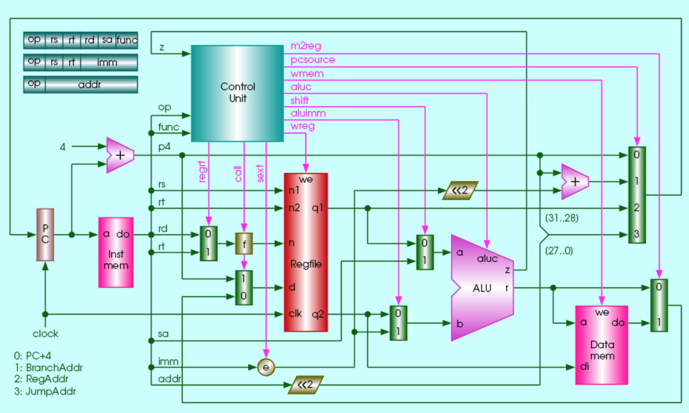

# 实验报告 基本单周期CPU设计

- 学号: 516202910010
- 姓名: 邓公淯

## 实验目的

1. 理解计算机5大组成部分的协调工作原理，理解存储程序自动执行的原理。
2. 掌握运算器、存储器、控制器的设计和实现原理。重点掌握控制器设计原理和实现方法。
3. 掌握I/O端口的设计方法，理解I/O地址空间的设计方法。
4. 会通过设计I/O读那口与外部设备进行信息交互。

## 实验内容

1. 采用Verilog HDL在quartus II中实现基本的具有20条MIPS指令的单周期CPU设计。
2. 利用实验提供的标准测试程序代码，完成仿真测试。
3. 采用I/O统一编址方式实现CPU与外部设备的输入输出端口设计。
4. 利用设计的I/O端口，通过lw指令，输入DE2实验板上的按键等输入设备信息，即将外部设备状态读到CPU内部寄存器。
5. 利用设计的I/O端口，通过sw指令，输出对DE2实验板上的LED灯灯输出设备的控制信号。
6. 利用自己的编写的程序代码，在自己设计的CPU上，实现对板载输入开关或按键的状态输入，并将判别或处理结果，利用板载LED灯或7段LED数码管显示出来。
7. 将一路4bit二进制输入与另一路4bit二进制输入相加，利用两组分别2个LED数码管以10进制形式显示“被加数”和“加数”，另一组LED数码管以10进制形式显示“和”。

## 实验仪器

- 硬件: DE1-SoC实验板
- 软件: Altera Quartus II 13.1 Web Edition, Altera ModelSim 10.1d

## 实验过程

### 顶层设计



```verilog
module sc_computer (resetn,clock,mem_clk,pc,inst,aluout,memout,imem_clk,dmem_clk,
						hex0,hex1,hex2,hex3,hex4,hex5,
						switch_input);

   input resetn,clock,mem_clk;
   output [31:0] pc,inst,aluout,memout;
   output        imem_clk,dmem_clk;
   wire   [31:0] data;
   wire          wmem; // all these "wire"s are used to connect or interface the cpu,dmem,imem and so on.

	input [7:0] switch_input;
	output [6:0] hex0,hex1,hex2,hex3,hex4,hex5;

   sc_cpu cpu (clock,resetn,inst,memout,pc,wmem,aluout,data);          // CPU module.
   sc_instmem  imem (pc,inst,clock,mem_clk,imem_clk);                  // instruction memory.
   sc_datamem  dmem (aluout,data,memout,wmem,clock,mem_clk,dmem_clk,
						hex0,hex1,hex2,hex3,hex4,hex5,switch_input); // data memory.

endmodule
```

基于预先给出的代码框架，顶层设计如上述代码所示，在将程序写入实验板时需要使用(即需要分配针脚)的为`mem_clk`, `clock`时钟信号输入，`switch_input`8位开关信号输入，和`hex5..hex0`六个7段管信号输出。

其余的输入输出接口只在仿真过程中使用，用于监测和调试CPU各组件中的信号变化。

顶层模块由三个部分组成: CPU, ROM, RAM。由于采用了I/O统一编址的方式，将RAM高地址映射到外部设备上，故而拓展了RAM使其接8位开关信号输入和6个七段管的信号输出，并在其中添加了与之对应的逻辑代码。

### ROM

```verilog
module sc_instmem (addr,inst,clock,mem_clk,imem_clk);
   input  [31:0] addr;
   input         clock;
   input         mem_clk;
   output [31:0] inst;
   output        imem_clk;
   
   wire          imem_clk;

   assign  imem_clk = clock & ( ~ mem_clk );      
   
   lpm_rom_irom irom (addr[7:2],imem_clk,inst); 
   

endmodule 

module lpm_rom_irom (
	address,
	clock,
	q);

	input	[5:0]  address;
	input	  clock;
	output	[31:0]  q;
`ifndef ALTERA_RESERVED_QIS
// synopsys translate_off
`endif
	tri1	  clock;
`ifndef ALTERA_RESERVED_QIS
// synopsys translate_on
`endif

	wire [31:0] sub_wire0;
	wire [31:0] q = sub_wire0[31:0];

	altsyncram	altsyncram_component (
				.clock0 (clock),
				.address_a (address),
				.q_a (sub_wire0),
				.aclr0 (1'b0),
				.aclr1 (1'b0),
				.address_b (1'b1),
				.addressstall_a (1'b0),
				.addressstall_b (1'b0),
				.byteena_a (1'b1),
				.byteena_b (1'b1),
				.clock1 (1'b1),
				.clocken0 (1'b1),
				.clocken1 (1'b1),
				.clocken2 (1'b1),
				.clocken3 (1'b1),
				.data_a ({32{1'b1}}),
				.data_b (1'b1),
				.eccstatus (),
				.q_b (),
				.rden_a (1'b1),
				.rden_b (1'b1),
				.wren_a (1'b0),
				.wren_b (1'b0));
	defparam
		altsyncram_component.clock_enable_input_a = "BYPASS",
		altsyncram_component.clock_enable_output_a = "BYPASS",
		altsyncram_component.init_file = "./calc_instmem.mif",
		altsyncram_component.intended_device_family = "Cyclone V",
		altsyncram_component.lpm_hint = "ENABLE_RUNTIME_MOD=NO",
		altsyncram_component.lpm_type = "altsyncram",
		altsyncram_component.maximum_depth = 256,
		altsyncram_component.numwords_a = 64,
		altsyncram_component.operation_mode = "ROM",
		altsyncram_component.outdata_aclr_a = "NONE",
		altsyncram_component.outdata_reg_a = "UNREGISTERED",
		altsyncram_component.ram_block_type = "M4K",
		altsyncram_component.widthad_a = 6,
		altsyncram_component.width_a = 32,
		altsyncram_component.width_byteena_a = 1;


endmodule
```

基于Altera提供的megafunction`ROM:1-PORT`实现，对输入输出接口再次封装一层之后作为指令存储。

### RAM

```verilog
module sc_datamem (addr,datain,dataout,we,clock,mem_clk,dmem_clk,
						hex0,hex1,hex2,hex3,hex4,hex5,
						switch_input);
 
   input  [31:0]  addr;
   input  [31:0]  datain;
   
   input          we, clock,mem_clk;
   output [31:0]  dataout;
	wire [31:0] mem_dataout;
	reg [31:0] io_dataout;
   output         dmem_clk;
	
	input [7:0] switch_input;
	output reg [6:0] hex0,hex1,hex2,hex3,hex4,hex5;
   
   wire           dmem_clk;    
   wire           write_enable; 
   assign         write_enable = we & ~clock; 
   
   assign         dmem_clk = mem_clk & ( ~ clock) ; 
   
   lpm_ram_dq_dram  dram(addr[6:2],dmem_clk,datain,write_enable,mem_dataout );
	mux2x32 mux_mem_io_dataout(mem_dataout,io_dataout,addr[31],dataout);
	
	reg [6:0] ledsegments_low,ledsegments_high;
	reg [5:0] decimal_low,decimal_high;
	always@(posedge dmem_clk) begin
		if(we & addr[31]) begin
		
			decimal_low = datain[6:0] % 10;
			decimal_high = datain[6:0] / 10;
			
			case(decimal_low)
				0:ledsegments_low = 7'b100_0000;
				1:ledsegments_low = 7'b111_1001;
				2:ledsegments_low = 7'b010_0100;
				3:ledsegments_low = 7'b011_0000;
				4:ledsegments_low = 7'b001_1001;
				5:ledsegments_low = 7'b001_0010;
				6:ledsegments_low = 7'b000_0010;
				7:ledsegments_low = 7'b111_1000;
				8:ledsegments_low = 7'b000_0000;
				9:ledsegments_low = 7'b001_0000;
				default:ledsegments_low = 7'b111_1111;
			endcase
			case(decimal_high)
				0:ledsegments_high = 7'b100_0000;
				1:ledsegments_high = 7'b111_1001;
				2:ledsegments_high = 7'b010_0100;
				3:ledsegments_high = 7'b011_0000;
				4:ledsegments_high = 7'b001_1001;
				5:ledsegments_high = 7'b001_0010;
				6:ledsegments_high = 7'b000_0010;
				7:ledsegments_high = 7'b111_1000;
				8:ledsegments_high = 7'b000_0000;
				9:ledsegments_high = 7'b001_0000;
				default:ledsegments_high = 7'b111_1111;
			endcase
			
			case(addr)
				32'hffffff00:	begin
					hex1 <= ledsegments_high;
					hex0 <= ledsegments_low;
				end
				32'hffffff10:	begin
					hex3 <= ledsegments_high;
					hex2 <= ledsegments_low;
				end
				32'hffffff20:	begin
					//hex5 <= 7'b1111111;
					hex5 <= ledsegments_high;
					hex4 <= ledsegments_low;
				end
			endcase
		end
	end

	always@(posedge dmem_clk) begin
		case(addr)
			32'hffffff60: io_dataout <= {28'b0,switch_input[3:0]};
			32'hffffff64: io_dataout <= {28'b0,switch_input[7:4]};
		endcase
	end
endmodule 

module lpm_ram_dq_dram (
	address,
	clock,
	data,
	wren,
	q);

	input	[4:0]  address;
	input	  clock;
	input	[31:0]  data;
	input	  wren;
	output	[31:0]  q;
`ifndef ALTERA_RESERVED_QIS
// synopsys translate_off
`endif
	tri1	  clock;
`ifndef ALTERA_RESERVED_QIS
// synopsys translate_on
`endif

	wire [31:0] sub_wire0;
	wire [31:0] q = sub_wire0[31:0];

	altsyncram	altsyncram_component (
				.wren_a (wren),
				.clock0 (clock),
				.address_a (address),
				.data_a (data),
				.q_a (sub_wire0),
				.aclr0 (1'b0),
				.aclr1 (1'b0),
				.address_b (1'b1),
				.addressstall_a (1'b0),
				.addressstall_b (1'b0),
				.byteena_a (1'b1),
				.byteena_b (1'b1),
				.clock1 (1'b1),
				.clocken0 (1'b1),
				.clocken1 (1'b1),
				.clocken2 (1'b1),
				.clocken3 (1'b1),
				.data_b (1'b1),
				.eccstatus (),
				.q_b (),
				.rden_a (1'b1),
				.rden_b (1'b1),
				.wren_b (1'b0));
	defparam
		altsyncram_component.clock_enable_input_a = "BYPASS",
		altsyncram_component.clock_enable_output_a = "BYPASS",
		altsyncram_component.init_file = "./sc_datamem.mif",
		altsyncram_component.intended_device_family = "Cyclone V",
		altsyncram_component.lpm_hint = "ENABLE_RUNTIME_MOD=NO",
		altsyncram_component.lpm_type = "altsyncram",
		altsyncram_component.numwords_a = 32,
		altsyncram_component.operation_mode = "SINGLE_PORT",
		altsyncram_component.outdata_aclr_a = "NONE",
		altsyncram_component.outdata_reg_a = "UNREGISTERED",
		altsyncram_component.power_up_uninitialized = "FALSE",
		altsyncram_component.ram_block_type = "M4K",
		altsyncram_component.widthad_a = 5,
		altsyncram_component.width_a = 32,
		altsyncram_component.width_byteena_a = 1;


endmodule
```

基于Altera的megafunction`RAM:1-PORT`实现，加入了对高地址的判断，将高地址的读写映射到外部I/O设备:

- 对`0xffffff00`,`0xffffff10`,`0xffffff20`地址的写入会被映射输出到七段LED上。
- 对`0xffffff60`,`0xffffff64`地址的读取会映射到外部开关的4位输入信号。

### CPU

```verilog
module sc_cpu (clock,resetn,inst,mem,pc,wmem,alu,data);
   input [31:0] inst,mem;
   input clock,resetn;
   output [31:0] pc,alu,data;
   output wmem;
   
   wire [31:0]   p4,bpc,npc,adr,ra,alua,alub,res,alu_mem;
   wire [3:0]    aluc;
   wire [4:0]    reg_dest,wn;
   wire [1:0]    pcsource;
   wire          zero,wmem,wreg,regrt,m2reg,shift,aluimm,jal,sext;
   wire [31:0]   sa = { 27'b0, inst[10:6] }; // extend to 32 bits from sa for shift instruction
   wire          e = sext & inst[15];          // positive or negative sign at sext signal
   wire [15:0]   imm = {16{e}};                // high 16 sign bit
   wire [31:0]   offset = {imm[13:0],inst[15:0],1'b0,1'b0};   //offset(include sign extend)
   wire [31:0]   immediate = {imm,inst[15:0]}; // sign extend to high 16
   
   dff32 ip (npc,clock,resetn,pc);  // define a D-register for PC
   
   // cla32 pcplus4 (pc,32¡¯h4, 1¡¯b0,p4);
   // cla32 br_adr (p4,offset,1¡¯b0,adr);
   
   assign p4 = pc + 32'h4;       // modified
   assign adr = p4 + offset;     // modified
   
   wire [31:0] jpc = {p4[31:28],inst[25:0],1'b0,1'b0}; // j address 
   
   sc_cu cu (inst[31:26],inst[5:0],zero,wmem,wreg,regrt,m2reg,
                        aluc,shift,aluimm,pcsource,jal,sext);
                        
                        
   mux2x32 alu_b (data,immediate,aluimm,alub);
   mux2x32 alu_a (ra,sa,shift,alua);
   mux2x32 result(alu,mem,m2reg,alu_mem);
   mux2x32 link (alu_mem,p4,jal,res);
   mux2x5 reg_wn (inst[15:11],inst[20:16],regrt,reg_dest);
   assign wn = reg_dest | {5{jal}}; // jal: r31 <-- p4;      // 31 or reg_dest
   mux4x32 nextpc(p4,adr,ra,jpc,pcsource,npc);
   regfile rf (inst[25:21],inst[20:16],res,wn,wreg,clock,resetn,ra,data);
   alu al_unit (alua,alub,aluc,alu,zero);
endmodule
```

CPU模块包含了alu，regfile，cu以及符号拓展、各种逻辑选择判断。

### CU

```verilog
module sc_cu (op, func, z, wmem, wreg, regrt, m2reg, aluc, shift,
              aluimm, pcsource, jal, sext);
   input  [5:0] op,func;
   input        z;
   output       wreg,regrt,jal,m2reg,shift,aluimm,sext,wmem;
   output [3:0] aluc;
   output [1:0] pcsource;
   wire r_type = ~|op;
   wire i_add = r_type & func[5] & ~func[4] & ~func[3] &
                ~func[2] & ~func[1] & ~func[0];          //100000
   wire i_sub = r_type & func[5] & ~func[4] & ~func[3] &
                ~func[2] &  func[1] & ~func[0];          //100010
      
   //  please complete the deleted code.
   
   wire i_and = r_type &  func[5] & ~func[4] & ~func[3] &  func[2] & ~func[1] & ~func[0]; //100100
   wire i_or  = r_type &  func[5] & ~func[4] & ~func[3] &  func[2] & ~func[1] &  func[0]; //100101

   wire i_xor = r_type & func == 6'b100110;
   wire i_sll = r_type & func == 6'b000000;
   wire i_srl = r_type & func == 6'b000010;
   wire i_sra = r_type & func == 6'b000011;
   wire i_jr  = r_type & func == 6'b001000;
                
   wire i_addi = op == 6'b001000;
   wire i_andi = op == 6'b001100;
   
   wire i_ori  = op == 6'b001101;
   wire i_xori = op == 6'b001110;
   wire i_lw   = op == 6'b100011;
   wire i_sw   = op == 6'b101011;
   wire i_beq  = op == 6'b000100;
   wire i_bne  = op == 6'b000101;
   wire i_lui  = op == 6'b001111;
   wire i_j    = op == 6'b000010;
   wire i_jal  = op == 6'b000011;
   
  
   assign pcsource[1] = i_jr | i_j | i_jal;
   assign pcsource[0] = ( i_beq & z ) | (i_bne & ~z) | i_j | i_jal ;
   
   assign wreg = i_add | i_sub | i_and | i_or   | i_xor  |
                 i_sll | i_srl | i_sra | i_addi | i_andi |
                 i_ori | i_xori | i_lw | i_lui  | i_jal;
   
   assign aluc[3] = i_sra;
   assign aluc[2] = i_sub | i_or | i_lui | i_srl | i_sra | i_ori | i_bne | i_beq;
   assign aluc[1] = i_xor | i_lui | i_sll | i_srl | i_sra | i_xori;
   assign aluc[0] = i_and | i_or | i_sll | i_srl | i_sra | i_andi | i_ori;
   assign shift   = i_sll | i_srl | i_sra ;

   assign aluimm  = i_addi | i_andi | i_ori | i_xori | i_lw | i_sw | i_lui;
   assign sext    = i_addi | i_lw | i_sw | i_beq | i_bne;
   assign wmem    = i_sw;
   assign m2reg   = i_lw;
   assign regrt   = i_addi | i_andi | i_ori | i_xori | i_lw | i_lui;
   assign jal     = i_jal;

endmodule
```

通过op, func, z输入来对cpu逻辑判断作出决定。

### Regfile

```verilog
module regfile (rna,rnb,d,wn,we,clk,clrn,qa,qb);
   input [4:0] rna,rnb,wn;
   input [31:0] d;
   input we,clk,clrn;

   output [31:0] qa,qb;

   reg [31:0] register [1:31]; // r1 - r31

   assign qa = (rna == 0)? 0 : register[rna]; // read
   assign qb = (rnb == 0)? 0 : register[rnb]; // read

   integer i;

   always @(posedge clk or negedge clrn) begin
      if (clrn == 0) begin // reset
         for (i=1; i<32; i=i+1)
            register[i] <= 0;
      end else begin
         if ((wn != 0) && (we == 1))          // write
            register[wn] <= d;
      end
   end
endmodule
```

简单的判断寄存器的读写位置以及保存或者输出相应的数据。

### ALU

```verilog
module alu (a,b,aluc,s,z);
   input [31:0] a,b;
   input [3:0] aluc;
   output [31:0] s;
   output        z;
   reg [31:0] s;
   reg        z;
   always @ (a or b or aluc) 
      begin                                   // event
         casex (aluc)
             4'bx000: s = a + b;              //x000 ADD
             4'bx100: s = a - b;              //x100 SUB
             4'bx001: s = a & b;              //x001 AND
             4'bx101: s = a | b;              //x101 OR
             4'bx010: s = a ^ b;              //x010 XOR
             4'bx110: s = b << 16;            //x110 LUI: imm << 16bit             
             4'b0011: s = b << a;             //0011 SLL: rd <- (rt << sa)
             4'b0111: s = b >> a;             //0111 SRL: rd <- (rt >> sa) (logical)
             4'b1111: s = $signed(b) >>> a;   //1111 SRA: rd <- (rt >> sa) (arithmetic)
             default: s = 0;
         endcase
         if (s == 0 )  z = 1;
            else z = 0;         
      end      
endmodule 
```

对输入进行算术/逻辑运算后产生相应输出和控制信号。

### 加法器汇编程序

```
DEPTH = 16;           % Memory depth and width are required %
WIDTH = 32;           % Enter a decimal number %
ADDRESS_RADIX = HEX;  % Address and value radixes are optional %
DATA_RADIX = HEX;     % Enter BIN, DEC, HEX, or OCT; unless %
                      % otherwise specified, radixes = HEX %
CONTENT
BEGIN
[0..F] : 00000000;   % Range--Every address from 0 to 1F = 00000000 %

1 : 3c01ffff;        % (04)       lui $1,0x7fff    #  %
2 : 3422ff00;        % (08)       ori $2,$1,0xff00 #  %
4 : 8c440060;        % (10)       lw $4,96($2)     #  %
5 : ac440010;        % (14)       sw $4,16($2)     #  %
7 : 8c450064;        % (1c)       lw $5,100($2)    #  %
8 : ac450020;        % (20)       sw $5,32($2)     #  %
A : 00853020;        % (28)       add $6,$4,$5     #  %
B : ac460000;        % (2c)       sw $6,0($2)      #  %
D : 08000000;        % (34)       j loop           #  %
END ;
```

该程序为一个简单的无限循环不断的将两个4位开关信号输入读入之后相加并分别输出到对应7段LED灯。

### 仿真顶层
```verilog
`timescale 1ps/1ps            // 仿真时间单位/时间精度
module sc_computer_sim;

    reg           resetn_sim;
    reg           clock_50M_sim;
	 reg           mem_clk_sim;
	 reg    [31:0] in_port0_sim;
	 reg    [31:0] in_port1_sim;

    wire   [6:0]  hex0_sim,hex1_sim,hex2_sim,hex3_sim,hex4_sim,hex5_sim;
	 wire          led0_sim,led1_sim,led2_sim,led3_sim;

	 wire   [31:0]  pc_sim,inst_sim,aluout_sim,memout_sim;
    wire           imem_clk_sim,dmem_clk_sim;
    wire   [31:0]  out_port0_sim,out_port1_sim;
    wire   [31:0]  mem_dataout_sim;            // to check data_mem output
    wire   [31:0]  data_sim;
    wire   [31:0]  io_read_data_sim;
    wire [7:0] sw_input;
    assign sw_input = 8'b00100001;

    wire           wmem_sim;   // connect the cpu and dmem.

    sc_computer    sc_computer_instance (resetn_sim,clock_50M_sim,mem_clk_sim,pc_sim,inst_sim,aluout_sim,memout_sim,
	                                      imem_clk_sim,dmem_clk_sim,
                                          hex0_sim,hex1_sim,hex2_sim,hex3_sim,hex4_sim,hex5_sim,sw_input
													  );
	 initial
        begin
            clock_50M_sim = 1;
            while (1)
                #2  clock_50M_sim = ~clock_50M_sim;
        end

	 initial
        begin
            mem_clk_sim = 1;
            while (1)
                #1  mem_clk_sim = ~ mem_clk_sim;
        end

	 initial
        begin
            resetn_sim = 0;            // 低电平持续10个时间单位，后一直为1。
            while (1)
                #5 resetn_sim = 1;
        end

	 initial
	     begin
		      in_port0_sim = 0;
				in_port1_sim = 0;
		  end

    initial
        begin

          $display($time,"resetn=%b clock_50M=%b  mem_clk =%b", resetn_sim, clock_50M_sim, mem_clk_sim);

			 # 125000 $display($time,"out_port0 = %b  out_port1 = %b ", out_port0_sim,out_port1_sim );

        end

endmodule
```

由于在仿真中没有来自外部的信号输入，该模块用于在仿真过程中向模块输入时钟，I/O等信号以在仿真过程中模拟出特定的工作环境。

## 实验总结

1. 通过这次实验让我进一步明白了CPU的工作原理，I/O统一编址方式的实现，软硬件工作的相互协调工作模式。
2. 在复杂的项目中，仿真调试的重要性更为凸显，相较于生成写入实验板的目标程序，仿真的快速编译和明晰的波形监控提供了更为方便的调试过程，同时为了进行仿真模拟，也需要做许多额外的工作，例如对顶层封装的仿真模块。
3. 在拓展外部I/O来实现加法器的过程中，更让我明白了能够通过硬件来对算法进行专门优化和单用软件进行复杂的运算来简化硬件复杂性之间的权衡，而在本次实验中便采用的是以硬件的复杂性来简化软件算法。
