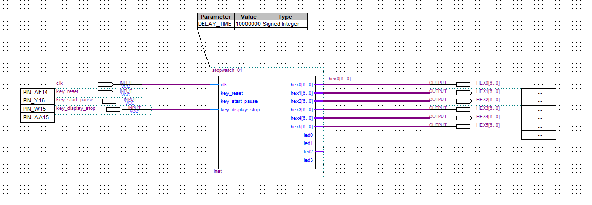

# 实验报告 基于Verilog和FPGA/CPLD的多功能秒表设计

- 学号: 516202910010 
- 姓名: 邓公淯

## 实验目的

1. 初步掌握利用Verilog硬件描述语言进行逻辑功能设计的原理和方法。
2. 理解和掌握运用大规模可编程逻辑器件进行逻辑设计的原理和方法。
3. 理解硬件实现方法中的并行性，联系软件实现方法中的并发性。
4. 理解硬件和软件是相辅相成、并在设计和应用方法上的优势互补的特点。

## 实验内容和任务

1. 运用Verilog硬件描述语言，基于DE1-SOC实验板，设计实现一个具有较多功能的计时秒表。
2. 要求将6个数码管设计为具有“分：秒：毫秒”显示，按键的控制动作有：“计时复位”、“计数/暂停”、
“显示暂停/显示继续”等，功能能够满足马拉松或长跑运动员的计时需要。
3. 利用示波器观察按键的抖动，设计按键电路的消抖方法。
4. 在实验报告中详细报告自己的设计过程、步骤及Verilog代码。

## 实验仪器

1. 硬件： DE1-SoC实验板
2. 软件： ALtera Quartus II 13.1 Web Edition

## 实验过程

1. 以指导书上的代码模版为基础，结合实验要求进行分析设计。
2. 建立工程，结合官方文档编写并调试项目，编译得到目标程序。
3. 将目标程序写入实验板，进行最后的调试。

### 顶层设计



- 输入为接入板载50MHz的时钟和三个按键。
- 输出为6个7段管的7bit二进制值。
- 秒表完整逻辑全部包含于stopwatch_01模块中。

### 主要代码

```verilog
module stopwatch_01(clk,key_reset,key_start_pause,key_display_stop,
							hex0,hex1,hex2,hex3,hex4,hex5,
							led0,led1,led2,led3);
	input	clk,key_reset,key_start_pause,key_display_stop;
	output [6:0] hex0,hex1,hex2,hex3,hex4,hex5;
	output led0,led1,led2,led3;
	reg led0,led1,led2,led3;

	reg display_work;
	reg counter_work;

	parameter DELAY_TIME = 10000000;

	reg [3:0] minute_display_high;
	reg [3:0] minute_display_low;
	reg [3:0] second_display_high;
	reg [3:0] second_display_low;
	reg [3:0] msecond_display_high;
	reg [3:0] msecond_display_low;

	reg [3:0] minute_counter_high;
	reg [3:0] minute_counter_low;
	reg [3:0] second_counter_high;
	reg [3:0] second_counter_low;
	reg [3:0] msecond_counter_high;
	reg [3:0] msecond_counter_low;

	reg [31:0] counter_50M;

	reg reset_1_time;
	reg [31:0] counter_reset;
	reg start_1_time;
	reg [31:0] counter_start;
	reg display_1_time;
	reg [31:0] counter_display;

	reg start;
	reg display;

	sevenseg LED8_minute_display_high(minute_display_high,hex5);
	sevenseg LED8_minute_display_low(minute_display_low,hex4);
	sevenseg LED8_second_display_high(second_display_high,hex3);
	sevenseg LED8_second_display_low(second_display_low,hex2);
	sevenseg LED8_msecond_display_high(msecond_display_high,hex1);
	sevenseg LED8_msecond_display_low(msecond_display_low,hex0);

	initial
	begin
		display_work = 0;
		counter_work = 0;

		minute_display_high = 0;
		minute_display_low = 0;
		second_display_high = 0;
		second_display_low = 0;
		msecond_display_high = 0;
		msecond_display_low = 0;

		minute_counter_high = 0;
		minute_counter_low = 0;
		second_counter_high = 0;
		second_counter_low = 0;
		msecond_counter_high = 0;
		msecond_counter_low = 0;

		counter_50M = 0;

		reset_1_time = 0;
		counter_reset = 0;
		start_1_time = 0;
		counter_start = 0;
		display_1_time = 0;
		counter_display = 0;

		start = 0;
		display = 0;
	end

	// process with input and display at each clk posedge
	always@(posedge clk)
	begin

		// increase the minimal counter when counter_work is true
		if(counter_work)counter_50M = counter_50M + 1;

		// update LEDs when display_work is true
		if(display_work)
		begin
			minute_display_high  = minute_counter_high;
			minute_display_low   = minute_counter_low;
			second_display_high  = second_counter_high;
			second_display_low   = second_counter_low;
			msecond_display_high = msecond_counter_high;
			msecond_display_low  = msecond_counter_low;
		end

		// check input with joggle removing
		// it looks like triggering on the button pressed down rather up
		if(!key_display_stop && !counter_display)counter_display = 1;
		if(counter_display)counter_display = counter_display + 1;
		if(!key_reset && !counter_reset)counter_reset = 1;
		if(counter_reset)counter_reset = counter_reset + 1;
		if(!key_start_pause&& !counter_start)counter_start = 1;
		if(counter_start)counter_start = counter_start + 1;

		if(counter_reset == DELAY_TIME)
		begin
			minute_display_high = 0;
			minute_display_low = 0;
			second_display_high = 0;
			second_display_low = 0;
			msecond_display_high = 0;
			msecond_display_low = 0;

			minute_counter_high = 0;
			minute_counter_low = 0;
			second_counter_high = 0;
			second_counter_low = 0;
			msecond_counter_high = 0;
			msecond_counter_low = 0;

			counter_50M = 0;
		end

		if(counter_display == DELAY_TIME)
		begin
			counter_display = 0;
			display_work = !display_work;
		end

		if(counter_start == DELAY_TIME)
		begin
			counter_start = 0;
			counter_work = !counter_work;
		end

		// process counter
		if(counter_50M == 500000)
		begin
			counter_50M = 0;
			msecond_counter_low = msecond_counter_low + 1;

			if(msecond_counter_low == 10)
			begin
				msecond_counter_high = msecond_counter_high + 1;
				msecond_counter_low = 0;
			end

			if(msecond_counter_high == 10)
			begin
				second_counter_low = second_counter_low + 1;
				msecond_counter_high = 0;
			end

			if(second_counter_low == 10)
			begin
				second_counter_high = second_counter_high + 1;
				second_counter_low = 0;
			end

			if(second_counter_high == 6)
			begin
				minute_counter_low = minute_counter_low + 1;
				second_counter_high = 0;
			end

			if(minute_counter_low == 10)
			begin
				minute_counter_high = minute_counter_high + 1;
				minute_counter_low = 0;
			end

			if(minute_counter_high == 10)
			begin
				minute_counter_high = 0;
			end
		end
	end

endmodule

module sevenseg(data,ledsegments);
	input [3:0] data;
	output ledsegments;
	reg [6:0] ledsegments;

	always@(*)
	case(data)
		0:ledsegments = 7'b100_0000;
		1:ledsegments = 7'b111_1001;
		2:ledsegments = 7'b010_0100;
		3:ledsegments = 7'b011_0000;
		4:ledsegments = 7'b001_1001;
		5:ledsegments = 7'b001_0010;
		6:ledsegments = 7'b000_0010;
		7:ledsegments = 7'b111_1000;
		8:ledsegments = 7'b000_0000;
		9:ledsegments = 7'b001_0000;
		default:ledsegments = 7'b111_1111;
	endcase
endmodule
```

### 消除抖动

```verilog
		// check input with joggle removing
		// it looks like triggering on the button pressed down rather up
		if(!key_display_stop && !counter_display)counter_display = 1;
		if(counter_display)counter_display = counter_display + 1;
		if(!key_reset && !counter_reset)counter_reset = 1;
		if(counter_reset)counter_reset = counter_reset + 1;
		if(!key_start_pause&& !counter_start)counter_start = 1;
		if(counter_start)counter_start = counter_start + 1;

		if(counter_reset == DELAY_TIME) ...
		if(counter_display == DELAY_TIME) ...
		if(counter_start == DELAY_TIME) ...
```

一个能够保证长按的幂等判断和延时触发逻辑。

### 十进制转换为七段管信号

```verilog
module sevenseg(data,ledsegments);
	input [3:0] data;
	output ledsegments;
	reg [6:0] ledsegments;

	always@(*)
	case(data)
		0:ledsegments = 7'b100_0000;
		1:ledsegments = 7'b111_1001;
		2:ledsegments = 7'b010_0100;
		3:ledsegments = 7'b011_0000;
		4:ledsegments = 7'b001_1001;
		5:ledsegments = 7'b001_0010;
		6:ledsegments = 7'b000_0010;
		7:ledsegments = 7'b111_1000;
		8:ledsegments = 7'b000_0000;
		9:ledsegments = 7'b001_0000;
		default:ledsegments = 7'b111_1111;
	endcase
endmodule
```

## 实验总结

1. 在实践中**消抖**操作极为重要，原因如下：
	1. 消除因实验板接触问题而导致的实验板逻辑错误。
	2. 保证按钮触发的逻辑正确性。
	3. 防止误触。
2. 实验中需要频繁查询实验板的相关文档和参考，完成实验的过程包含了大量编码以外的操作，熟练的查询文档和使用Quartus II软件变得极为重要。
3. 实验包含了代码部分和相关的硬件部分，让我进一步明白到了软硬件如何相互协调工作。

