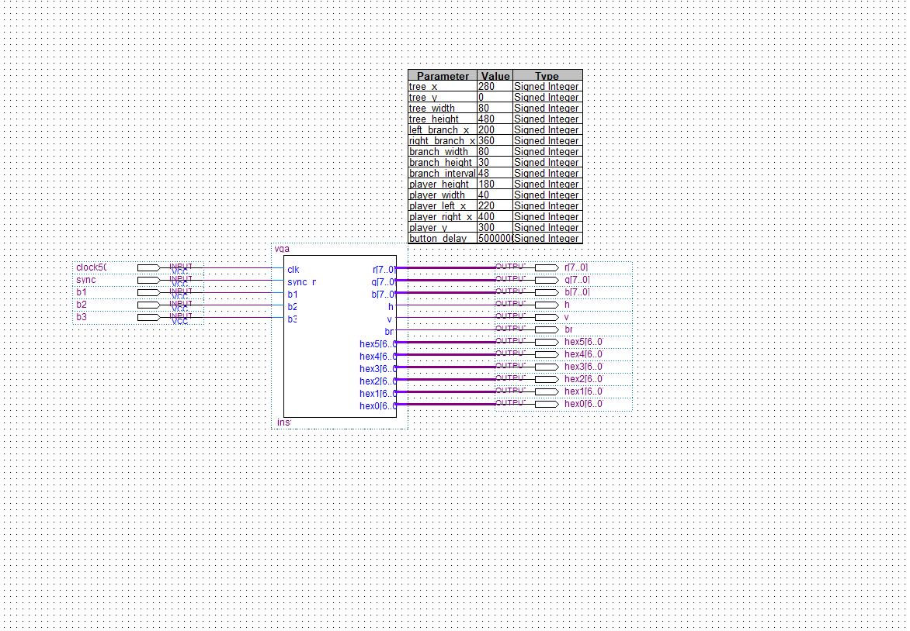

# （自选项目） 基于Verilog和FPGA的限时障碍躲避游戏-实验报告

- 学号：516202910010
- 姓名：邓公淯

## 实验目的

1. 理解和掌握VGA工作原理。
2. 综合本学期所学知识。
3. 通过实践与课本上所学的理论相互补充。

## 实验仪器与平台

- 硬件： DE1-SoC实验板
- 软件：Altera Quartus II 13.1

## 实验内容和任务

简单的使用Verilog编写了一套时序电路逻辑来实现了一个在30秒内考验玩家得障碍躲避数的游戏，并将游戏逻辑的画面实时通过VGA端口输出，同时也使用数码管来显示游戏倒计时和得分。

### 游戏内容

在规定时间内左右移动并前进，时间结束或撞上障碍物皆视为游戏结束。

- 按下Key3将位置移动到左方，并向前移动一个单位。
- 按下Key2将位置移动到右方，并向前移动一个单位。
- 按下Key1重置游戏。

### 详细设计

#### 顶层设计



子模块已包含在主模块中，故此处只有主模块的输入和输出。

#### 详细代码

#### 主模块

```verilog
module vga(clk, sync_n, b1, b2, b3, r, g, b, h, v, bn, 
	hex5, hex4, hex3, hex2, hex1, hex0);

    input clk, sync_n, b1, b2, b3;
		output [6:0] hex5, hex4, hex3, hex2, hex1, hex0;
    output reg [7:0] r, g, b;
    output h, v, bn;
    
    reg clk_v;
    wire[9:0] scanner_x, scanner_y;

    reg [5:0] rand_num;
    reg [6:0] score1, score2, timer1, timer2;
	 
		parameter integer tree_x = 280, tree_y = 0, tree_width = 80, tree_height = 480;
		parameter integer left_branch_x = 200, right_branch_x = 360, branch_width = 80, branch_height = 30, branch_interval = 48;
		parameter integer player_height = 180, player_width = 40, player_left_x = 220, player_right_x = 400, player_y = 300;
		parameter integer button_delay = 5000000;

		reg [6:0] left_branch_y, right_branch_y;
		reg player_pos, game_over = 0;
		reg [31:0] counter_b1, counter_b2, counter_b3, counter_rest, counter_over_delay;
		reg [5:0] rest_time;

    vga_gen vga_gen(clk_v, sync_n, scanner_y, scanner_x, h, v, bn);
    sevenseg s1(score1, hex1);
    sevenseg s2(score2, hex0);
    sevenseg t1(timer1, hex6);
    sevenseg t2(timer2, hex5);

    initial begin
			clk_v = 0;
			r = 0;
			g = 0;
			b = 0;

			rand_num = 34;
			game_over = 0;
			left_branch_y = 10'b0111010;
			right_branch_y = 10'b0000101;
			player_pos = 0;
			counter_b1 = 0;
			counter_b2 = 0;
			counter_b3 = 0;
			score1 = 0;
			score2 = 0;
			rest_time = 30;
			counter_rest = 0;
    end
	 
always @ (rest_time) begin 
	timer1 <= rest_time % 10;
	timer2 <= rest_time / 10;
end

always @ (posedge clk) begin
	// generate 25MHz
	clk_v <= ~clk_v;

	// update timer
	counter_rest <= counter_rest + 1;
	if( counter_rest == 50000000 && rest_time > 0 && !game_over) begin
		counter_rest <= 0;
		rest_time <= rest_time - 1;
	end
	
	// check buttons
	if (!b1 && !counter_b1) counter_b1 <= 1;
	if (counter_b1) counter_b1 <= counter_b1 + 1;
	if(counter_b1 == button_delay) begin
		if(b1 && !game_over) begin
			player_pos <= 0;
			counter_b1 <= 0;
			score1 <= score1 + 1;
			left_branch_y <= left_branch_y << 1 | (1 & rand_num);
			right_branch_y <= right_branch_y << 1 | (1 & ~rand_num);
		end
		else counter_b1 <= 1;
	end
	
	if (!b2 && !counter_b2) counter_b2 <= 1;
	if (counter_b2) counter_b2 <= counter_b2 + 1;
	if(counter_b2 == button_delay) begin
		if(b2 && !game_over) begin
			player_pos <= 1;
			counter_b2 <= 0;
			score1 <= score1 + 1;
			left_branch_y <= left_branch_y << 1 | (1 & rand_num);
			right_branch_y <= right_branch_y << 1 | (1 & ~rand_num);
		end
		else counter_b2 <= 1;
	end
	
	if (!b3 && !counter_b3) counter_b3 <= 1;
	if (counter_b3) counter_b3 <= counter_b3 + 1;
	if(counter_b3 == button_delay) begin
		if(b3) begin	 
			 game_over <= 0;
			 left_branch_y <= 10'b0111010;
			 right_branch_y <= 10'b0000101;
			 player_pos <= 0;
			 counter_b1 <= 0;
			 counter_b2 <= 0;
			 counter_b3 <= 0;
			 score1 <= 0;
			 score2 <= 0;
			 rest_time <= 30;
			 counter_rest <= 0;
		end
		else counter_b3 <= 1;
	end
	
	// check collision
	if(rest_time <= 0 || ((left_branch_y >> 6) & ~player_pos) || ((right_branch_y >> 6) & player_pos)) begin 
		game_over <= 1;
		//rest_time <= 0;
	end
	
	if (score1 == 10) begin
		score2 <= score2 + 1;
		score1 <= 0;
	end
end

// button pressed and evaluate
integer i,ky;
always @ (negedge clk) begin
   
	// update random number
	rand_num <= { rand_num[1:0], ~rand_num[5:2] };

	// draw background
	r <= 8'hc2;
	g <= 8'hff;
	b <= 8'hf8;
 
	// draw trunk
	if(scanner_x >= tree_x && scanner_x <= tree_x + tree_width) begin
		r <= 8'h56;
		g <= 8'h3f;
		b <= 8'h12;
	end
	
	// draw branches
	for(i=0;i<10;i=i+1)
		if((left_branch_y >> i) & 1) begin
			ky = i * branch_interval;
			if(scanner_x >= left_branch_x && scanner_x <= left_branch_x + branch_width && scanner_y >= ky && scanner_y <= ky + branch_height) begin
				r <= 8'h56;
				g <= 8'h3f;
				b <= 8'h12;
			end
		end
		else if((right_branch_y >> i) & 1) begin
			ky = i * branch_interval;
			if(scanner_x >= right_branch_x && scanner_x <= right_branch_x + branch_width && scanner_y >= ky && scanner_y <= ky + branch_height) begin
				r <= 8'h56;
				g <= 8'h3f;
				b <= 8'h12;
			end
		end
	
	// draw player
	if(scanner_y >= player_y && scanner_y <= player_y + player_height)
		if(!player_pos && scanner_x >= player_left_x && scanner_x <= player_left_x + player_width) begin
			r <= 8'hff;
			g <= 8'h42;
			b <= 8'h44;
		end
		else if(player_pos && scanner_x >= player_right_x && scanner_x <= player_right_x + player_width) begin
			r <= 8'hff;
			g <= 8'h42;
			b <= 8'h44;
		end
	
		
	if(game_over) begin 
		r <= 8'hff;
		g <= 8'h00;
		b <= 8'h00;
	end
	
end

endmodule
```

该模块包含了游戏的逻辑，并连接了各个子模块。

其实现逻辑即是根据当前游戏的数据模型针对每一个像素点提供对应的RGB值。

#### VGA坐标产生模块

```verilog
module vga_gen (clk, sync_n, row_i, col_i, sync_h, sync_v, blank_n);
    input clk, sync_n;

    output           sync_h, sync_v, blank_n;
    output reg [9:0] row_i, col_i;

    parameter integer visible_area_h = 640;
    parameter integer front_porch_h = 16;
    parameter integer sync_pulse_h = 96;
    parameter integer back_porch_h = 48;
    parameter integer whole_line_h = 800;

    parameter integer visible_area_v= 480;
    parameter integer front_porch_v= 10;
    parameter integer sync_pulse_v= 2;
    parameter integer back_porch_v= 33;
    parameter integer whole_line_v = 525;

    assign sync_v = ~(row_i >= visible_area_v + front_porch_v && row_i < visible_area_v + front_porch_v + sync_pulse_v);
    assign sync_h = ~(col_i >= visible_area_h + front_porch_h && col_i < visible_area_h + front_porch_h + sync_pulse_h);
    assign blank_n = row_i < visible_area_v && col_i < visible_area_h;

    initial begin
        row_i = 0;
        col_i = 0;
    end
    
    always @ (posedge clk) begin
        if (sync_n == 0) row_i <= 0; col_i <= 0;
      	else begin 
            col_i = col_i + 1;
            if (col_i == whole_line_h) begin
                col_i = 0;
                row_i = row_i + 1;
                if (row_i == whole_line_v) row_i = 0;
            end
        end
    end
  
endmodule
```

在每个25MHz的时钟上升沿计算当前VGA即将渲染的像素点的坐标位置。

#### 数码管转换模块

```verilog
module sevenseg(datain, ledsegments);
  input [3:0] datain;
	output ledsegments;
	reg [6:0] ledsegments;
	
	always @ (*)
    case(datain)
			0: ledsegments = 7'b100_0000;
			1: ledsegments = 7'b111_1001;
			2: ledsegments = 7'b010_0100;
			3: ledsegments = 7'b011_0000;
			4: ledsegments = 7'b001_1001;
			5: ledsegments = 7'b001_0010;
			6: ledsegments = 7'b000_0010;
			7: ledsegments = 7'b111_1000;
			8: ledsegments = 7'b000_0000;
			9: ledsegments = 7'b001_0000;
			default: ledsegments = 7'b111_1111;
		endcase
endmodule
```

根据输入的十进制数字，转换为数码管的7位输出信号。

## 实验总结

### 实验结果

通过Quartus II 的编译综合的代码写入FPGA实验板后能够达到预期的效果，对于正确的按钮操作，数码管和VGA显示器都有正确的输出。

### 经验教训

1. 由于这块租借的实验板在按钮处存在接触不良的现象，故而在不做按钮防抖的情况下，实验板会因为不稳定的电流信号导致逻辑错误，甚至无法进行正常的渲染工作，因此在实践环境下，按钮消抖的重要性可谓极高。
2. 将代码分解为模块之后，既可以在Quartus中采用Block Diagram的方式通过GUI将模块连结起来，也能够直接通过更高层次的代码（即.v文件）来将连结逻辑包含于其中。
3. 对于25MHz的VGA渲染频率，50MHz的FPGA需要将其渲染逻辑降频来保证正确的输出。

### 感受

通过本次实验我得以学会了通过FPGA来向VGA输出的方法，并巩固了本学期所学的其他的内容。所谓实践出真知，在实验中遇到问题并解决问题，这个过程让我更加深刻的理解的课堂上的知识，也有课堂之外的知识。